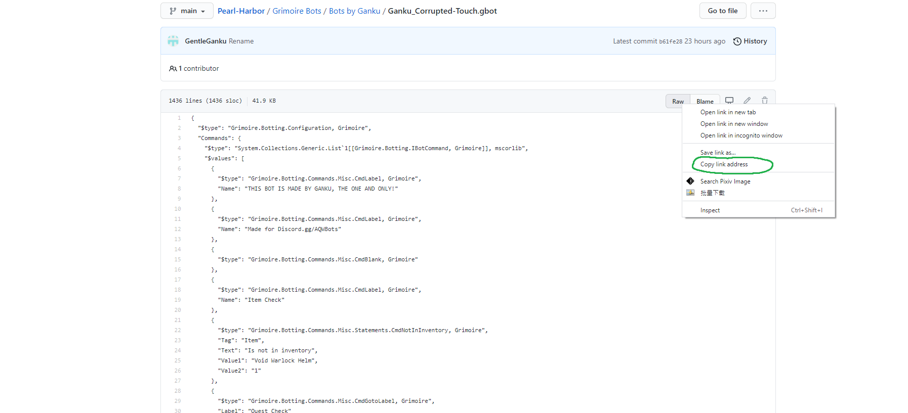

# Pearl Harbor: The AQW Sailor's Paradise

###### [Click here for our discord server link.](https://discord.io/AQWBots)
## Download Grimoire software
- To download Grimoire software, open the folder "Grimoire Client" or you can use this link: https://github.com/nicknggt/Pearl-Harbor/tree/main/Grimoire%20Client
- Inside that folder, simply left click on the Grimoire version (zip file) you would like to download and then click the "Download" button.

## Searching a bot file
- Before searching for a bot file, you must be at the ["Pearl-Harbor"](https://github.com/nicknggt/Pearl-Harbor) directory.

- Click on the button **Goto File**

- Search for the keywords you want (For example: "icestormarena"); you will see all results come out that having your keyword.

## Download a bot
### Note: most users they will do this when downloading a bot file. This is NOT WORKING!!!

### So to download the bot file appropriately, here's how you do:
- **Left click** on the bot file you like. (I'm using "Ganku_Corrupted-Touch.gbot" as an example)

- It should show like this as you left-clicked. Now **RIGHT CLICK** on the **Raw** button **(DO NOT LEFT-CLICK ON IT)**
- Select *Copy Link Address*

- Now goto the [Downgit website](https://minhaskamal.github.io/DownGit/#/home), *paste the link* you just copied and click on **Download** button!

- Your bot file should be in your download list. It might be in the zip file so basically just extract it, you are all set!

